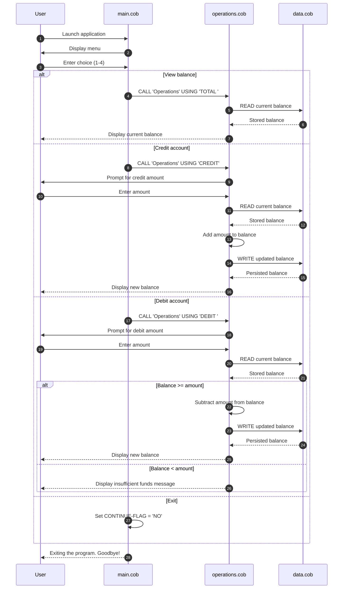

# Legacy COBOL Student Account System

## Overview

This project is a small COBOL-based account management program that simulates a student account balance workflow. It is organized into three programs:

- `main.cob` provides the user menu and top-level program flow.
- `operations.cob` performs the balance operations.
- `data.cob` stores and retrieves the current balance.

The system uses a single account balance initialized to `1000.00` and persists only in memory while the program runs.

---

## File-by-file purpose

### 1. `src/cobol/main.cob`

Purpose:
- Entry point for the application.
- Presents the user with a simple menu for account actions.
- Routes user choices to the operations program.

Key functions:
- `MAIN-LOGIC`: the main loop of the program.
- Uses a `PERFORM UNTIL` loop to continue until the user selects exit.
- Accepts a numeric option from `1` to `4`.

Menu behavior:
- `1` = View balance
- `2` = Credit account
- `3` = Debit account
- `4` = Exit

Business rules:
- Any invalid choice displays an error and requests another selection.
- The loop ends only when the user enters `4`, which moves the flag to `NO`.

---

### 2. `src/cobol/operations.cob`

Purpose:
- Implements the account operations used by the main program.
- Performs reads and writes to the student account balance through the data program.

Key functions:
- `PROCEDURE DIVISION USING PASSED-OPERATION`
- Checks the passed operation type and executes the corresponding action.

Supported operations:
- `TOTAL `: view the current account balance
- `CREDIT`: add an amount to the account
- `DEBIT `: subtract an amount from the account

Business rules:
- The account starts with a balance of `1000.00`.
- To credit an amount, the user is prompted for an amount and the system:
  1. Reads the current balance
  2. Adds the input amount
  3. Writes the new balance back
- To debit an amount, the user is prompted for an amount and the system:
  1. Reads the current balance
  2. Verifies that the balance is at least as large as the debit amount
  3. Subtracts the amount if sufficient funds exist
  4. Writes the updated balance back
- If the debit amount exceeds the balance, the system displays:
  `Insufficient funds for this debit.`

Important implementation note:
- The operation names are passed as fixed-width strings (`TOTAL ` and `DEBIT ` include trailing spaces). This is important because the code compares exact values.
- The `FINAL-BALANCE` field is initialized to `1000.00` and is updated by the data layer.

---

### 3. `src/cobol/data.cob`

Purpose:
- Represents the underlying balance storage for the account system.
- Acts as a simple data-access routine for reading and writing the current balance.

Key functions:
- `PROCEDURE DIVISION USING PASSED-OPERATION BALANCE`
- Handles `READ` and `WRITE` actions.

Behavior:
- When `READ` is passed, the stored account balance is copied into the caller's balance field.
- When `WRITE` is passed, the caller's balance value is saved to the stored account balance.

Business rules:
- The stored balance is initialized to `1000.00`.
- The data layer is intentionally simple: it does not enforce balance validation itself; validation happens in the operations layer.
- This program maintains the account state only during the lifetime of the runtime process.

---

## Student account business rules summary

The student account logic in this COBOL example follows a very simple rule set:

- Initial account balance: `1000.00`
- Balance can be viewed at any time.
- Credits increase the balance by the customer-entered amount.
- Debits reduce the balance by the customer-entered amount.
- A debit is allowed only when the account balance is greater than or equal to the amount requested.
- If a debit amount exceeds the available balance, the transaction is rejected.
- All account changes are written to the in-memory storage record and immediately reflected in later reads.

---

## Validation and flow notes

This is a minimal demonstration program rather than a production-grade banking system. It does not include:

- persistent storage (database or file-based records)
- user authentication or authorization
- multiple accounts or account history
- interest calculations or fees
- validation for negative amounts or malformed input

The program is best understood as a teaching example of COBOL procedure flow, parameter passing, and simple state management.

## App data flow

